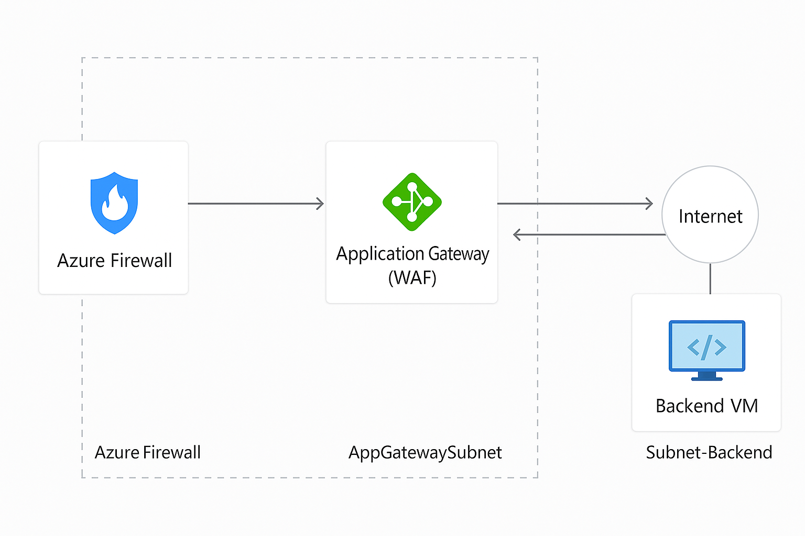

## Azure Firewall & Application Gateway (WAF) Lab

Implementation of enterprise-grade perimeter defense and web application protection using Azure Firewall and Application Gateway with WAF. This lab demonstrates real-world network segmentation, centralized traffic filtering, web threat mitigation and end-to-end visibility—addressing the growing need for advanced cloud security controls beyond NSGs.

---

## Table of Contents

- [Overview](#overview)
- [Real-World Risk](#real-world-risk)
- [What I Built](#what-i-built)
- [Diagram](#diagram)
- [Objectives](#objectives)
- [Steps Performed](#steps-performed)
  - [1. Resource Group and Virtual Network Setup]
  - [2. Azure Firewall Deployment]
  - [3. Application Gateway (WAF) Deployment]
  - [4. Backend VM Setup]
  - [5. Routing & Firewall Rules]
  - [6. WAF Policies and Testing]
  - [7. Security Controls Validation]
  - [8. Cleanup]
- [Screenshots](#screenshots)
- [Lessons Learned](#lessons-learned)
- [References](#references)
- [Contact](#contact)

--- 

## Overview

This lab demonstrates how to deploy layered, enterprise-class security for Azure workloads by combining Azure Firewall with Application Gateway (WAF). You’ll see how to control both network-level and application-level threats, implement custom firewall policies and prove that traffic is filtered and logged—fulfilling advanced compliance and audit requirements.

*Why it matters: Many organizations need more than basic NSG protection. Centralized firewalls and WAFs are critical for blocking malware, controlling outbound access, inspecting HTTP(S) traffic and defending against modern attacks. This lab shows you can design, implement and test those controls.

--- 

## Real-World Risk

- Relying on NSGs alone leaves gaps at the network edge and application layer, exposing cloud workloads to threats like lateral movement, data exfiltration and web application attacks (SQLi, XSS)
- Without centralized firewalling, you can’t enforce egress policies, block malware or gain visibility into cloud traffic.
- This lab demonstrates how to implement Azure Firewall to control network traffic and Application Gateway with WAF to protect web applications—addressing advanced threats and regulatory requirements in a real-world scenario.

---

## What I Built

- A secure, isolated VNET with dedicated subnets for Azure Firewall, Application Gateway and backend workloads.
- Azure Firewall deployed at the network edge, with custom rule collections for allowed and denied traffic.
- Application Gateway (WAF V2) in prevention mode, inspecting all HTTP(S) requests to backend applications.
- A backend VM (web server) as the protected application target.
- Custom route tables to force outbound VM traffic through the firewall.
- Realistic firewall and WAF rules to block or allow specific traffic (including outbound internet blocking)
- Step-by-step documentation with screenshots to prove controls and configuration.

---

## Diagram

---

## Objectives

- Deploy an isolated network architecture for enterprise security scenarios.
- Set up Azure Firewall with custom rule collections for ingress/egress control.
- Deploy Application Gateway with WAF to protect web apps against Layer 7 attacks.
- Prove that firewall and WAF rules block or allow expected traffic.
- Document, test and validate controls with evidence for technical/recruiter review.

---

## Steps Performed

**1. Resource Group and Virtual Network Setup**
   - Created resource group Lab05-NetworkSec-RG for lab isolation *(Screenshot: `vnet_and_subnets.png`)*
   - Deployed VNET Lab05-VNET with subnets: AzureFirewallSubnet, AppGatewaySubnet, BackendSubnet and AzureFirewallManagementSubnet (if required)

**2. Azure Firewall Deployment**
   - Deployed Lab05-AzureFirewall with dedicated public IP *(Screenshot: `azure_firewall_deployed.png`)*
   - Created and assigned Firewall Policy Lab05-Firewall-Policy.
   - Added required management subnet.

**3. Application Gateway (WAF) Deployment**
   - Deployed Lab05-AppGateway with public IP, WAF V2 SKU and WAF Policy in Prevention mode *(Screenshot: `app_gateway_review.png` & `app_gateway_overview.png`)*
   - Configured backend pool (initially empty; VM added later)

**4. Backend VM Setup**
   - Deployed Lab05-BackendVM in BackendSubnet (Ubuntu VM)
   - Connected using Azure Bastion; installed and started NGINX web server *(Screenshot: `backend_vm_created.png` & `backend_vm_running.png`)*

**5. Routing & Firewall Rules**
   - Created Route Table and associated with BackendSubnet to force all outbound traffic through Azure Firewall.
   - Configured Network Rule Collections (e.g., Allow-AppGW-HTTP, Allow-SSH-Admin, Deny-Backend-Internet) *(Screenshot: `firewall_rules.png`)*
   - Configured Application Rule Collections for FQDN filtering.

**6. WAF Policies and Testing**
   - Added WAF Policy in Prevention mode to Application Gateway.
   - Created custom WAF rules for SQLi/XSS blocking.
   - Connected App Gateway’s backend pool to VM private IP.

**7. Security Controls Validation**
   - Verified Application Gateway and WAF operation:
     - Backend health: Confirmed as “Healthy” *(Screenshot: `backend_health.png`)*
     - End-to-end test: Accessed App Gateway public IP and saw NGINX welcome page *(Screenshot: `nginx_via_appgw.png`)*
   - Tested Deny-Backend-Internet rule:
     - Outbound curl/ping/apt update from backend VM to external addresses blocked *(Screenshots: `backend_curl_http_blocked.png`, `backend_curl_https_blocked.png`, `backend_ping_ip_blocked.png` & `backend_apt_update_blocked.png`)*
   - Checked Firewall and WAF logs for evidence of blocked events.

**8. Cleanup**
   - Deleted all resources via resource group to prevent ongoing charges.

---

## Screenshots

*All screenshots are included in the `screenshots/` folder.*

| Step | Filename                          | Description                                     |
| ---- | --------------------------------- | ----------------------------------------------- |
| 1    | vnet_and_subnets.png              | VNET with all required subnets                  |
| 2    | azure_firewall_deployed.png       | Azure Firewall deployment and overview          |
| 3    | app_gateway_review.png            | App Gateway review+create (pre-deployment)      |
| 4    | app_gateway_overview.png          | App Gateway overview (status, IP, WAF, etc.)    |
| 5    | backend_vm_created.png            | Backend VM creation summary                     |
| 6    | backend_vm_running.png            | Backend VM web server (NGINX) running           |
| 7    | firewall_rules.png                | Firewall rule collections (allow/deny examples) |
| 8    | backend_health.png                | App Gateway backend health check                |
| 9    | nginx_via_appgw.png               | Browser shows NGINX via App Gateway public IP   |
| 10   | backend_curl_http_blocked.png     | HTTP egress blocked from backend VM             |
| 11   | backend_curl_https_blocked.png    | HTTPS egress blocked from backend VM            |
| 12   | backend_ping_ip_blocked.png       | Ping to IP blocked from backend VM              |
| 13   | backend_apt_update_blocked.png    | apt update blocked (shows internet block)       |

---

## Lessons Learned

- **Defense in Depth:** Built a layered cloud security model with centralized firewalling, WAF and enforced egress controls.
- **Real-World Risk Mitigation:** Demonstrated the importance of controlling outbound/inbound traffic and blocking web attacks at scale.
- **Route Table and Firewall Integration:** Learned to force subnet traffic through Azure Firewall using UDRs—a critical, often-overlooked security technique.
- **WAF Policy Effectiveness:** Saw how WAF can detect and block real attack patterns (like SQL injection) and log threats.
- **Documentation and Troubleshooting:** Developed skills for step-by-step troubleshooting and creating recruiter-ready documentation with evidence screenshots.
- **Resource Hygiene:** Practiced cleaning up resources to avoid cloud sprawl and unnecessary charges.

---

## References

- [Azure Firewall documentation](https://learn.microsoft.com/en-us/azure/firewall/)
- [Azure Application Gateway documentation](https://learn.microsoft.com/en-us/azure/application-gateway/)
- [Azure WAF documentation](https://learn.microsoft.com/en-us/azure/web-application-firewall/ag/ag-overview)
- [How to force egress traffic through Azure Firewall](https://learn.microsoft.com/en-us/azure/firewall/tutorial-firewall-deploy-portal)
- [Azure Bastion documentation](https://learn.microsoft.com/en-us/azure/bastion/)
- [Azure Network Security best practices](https://learn.microsoft.com/en-us/azure/security/fundamentals/network-best-practices)

---

## Contact

Sebastian Silva C. – July, 2025 – Berlin, Germany.  
[LinkedIn](https://www.linkedin.com/in/sebastiansilc) | [GitHub](https://github.com/SebaSilC) | [sebastian@playbookvisualarts.com](mailto:sebastian@playbookvisualarts.com)
